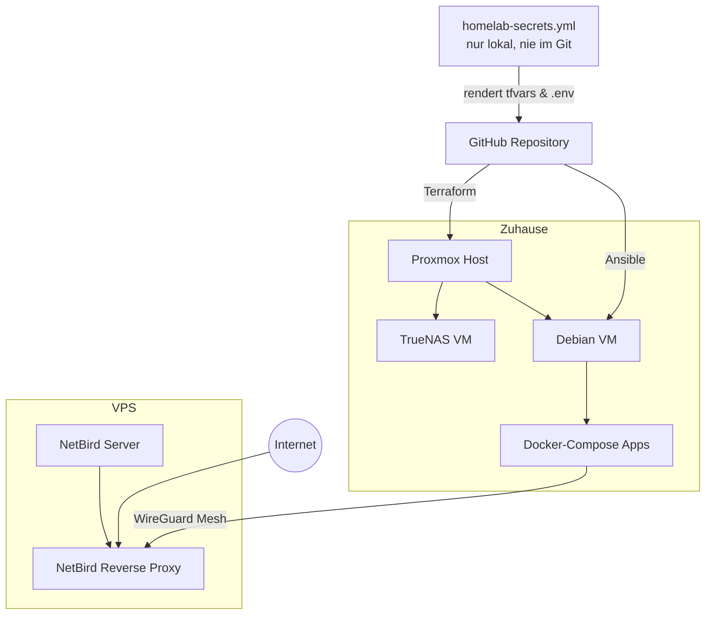

# Architektur

## Überblick



## Bausteine

**Proxmox** ist der physische Host zu Hause und trägt zwei VMs: TrueNAS (Storage) und Debian (Docker-Host für alle Anwendungen).

**Terraform** (`infrastructure/proxmox/terraform`) erstellt beide VMs deklarativ - VM-IDs, IP-Adressen, Festplatten-Zuordnung. Läuft von der Kontrollmaschine aus, bevor der Debian-Host überhaupt existiert.

**Ansible** (`infrastructure/ansible`) konfiguriert den Debian-Host danach: installiert Docker, klont das Repository nach `/homelab`, rendert die Secrets jeder App und startet alle Docker-Compose-Stacks. Ein einzelner Playbook-Lauf reicht für den kompletten Zustand.

**Docker Compose** startet jede Anwendung isoliert unter `/homelab/apps/<app>`. Jede App hat ihr eigenes Compose-File im Repository und ihre eigene, generierte `.env`-Datei.

**homelab-secrets.yml** ist die einzige Quelle für alle Zugangsdaten - Terraform-Variablen, App-Secrets, NetBird-API-Token. Liegt nur auf der Kontrollmaschine, nie im Repository. Mehr dazu unter [Sicherheit](security.md).

**NetBird** verbindet Docker-Host und VPS über ein WireGuard-Mesh. Der VPS betreibt zusätzlich die selbstgehostete NetBird-Management-Instanz und die Reverse-Proxy-Funktion, die einzelne Apps unter eigener Domain mit automatischem TLS-Zertifikat öffentlich erreichbar macht.

## Repository-Struktur

```text
homelab/
├── apps/                    Ein Ordner pro Anwendung, je ein docker-compose.yml
├── infrastructure/
│   ├── proxmox/terraform/   VM-Provisionierung
│   └── ansible/
│       ├── roles/           common, docker, homelab
│       └── playbooks/       docker-host.yml, render-terraform-vars.yml,
│                             sync-reverse-proxy.yml
└── homelab-secrets.yml.example
```

## Automatisierungs-Playbooks

| Playbook | Zweck |
| --- | --- |
| `docker-host.yml` | Debian-Host konfigurieren, Secrets rendern, alle Apps starten |
| `render-terraform-vars.yml` | `terraform.tfvars` aus `homelab-secrets.yml` erzeugen |
| `sync-reverse-proxy.yml` | Öffentliche NetBird-Services anlegen, aktualisieren, entfernen |

Alle drei sind idempotent: ein erneuter Lauf bringt den Zustand auf das, was in `homelab-secrets.yml` und dem Repository deklariert ist - unabhängig vom vorherigen Zustand.
