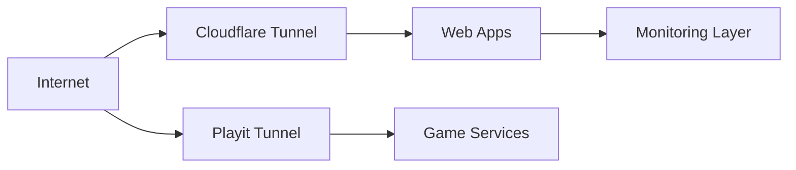

# Platform Layout

## Directory model

All services are managed as isolated compose projects.

| Layer | Path | Notes |
| :--- | :--- | :--- |
| Stack root | `/homelab/apps` | One directory per service |
| Compose file | `/homelab/apps/<service>/docker-compose.yml` | Entry file for deploy/update |
| Local secrets | `/homelab/apps/<service>/.env` | Service-local environment values |

## Runtime model

- Container runtime: Docker Engine
- Primary management UIs: Portainer, Dockge
- Secondary orchestration: Komodo (periphery on host)
- Documentation stack: MkDocs Material (`/homelab/apps/mkdocs`)

## Network model

## Exposure strategy

- Public entry is intentionally centralized through tunnel services.
- Most apps are bound to host ports in the `8000-8012` range.
- Game traffic uses dedicated ports (`63089/udp`, `25565/tcp`, `24444/tcp`).

## Change policy

- Treat `docker-compose.yml` and `.env` changes as production changes.
- Prefer one service change at a time.
- After each change: verify container state and health before moving on.
